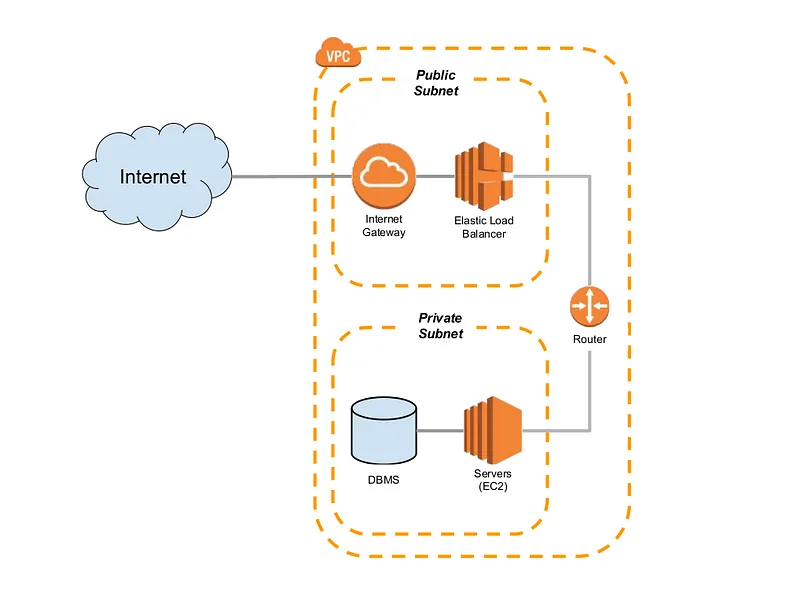

# Jenkins-Terraform-AWS-Infra

## **Detailed Article/Tutorial:** [**HERE**](https://prodevopsguy.tech/posts/aws-with-terraform-and-jenkins-pipeline)

This source code will create and manage the public and private subnets using terraform and create instance in the desired subnet.

### Prerequisites

* Basic knowledge of AWS & Terraform
* AWS account
* AWS Access & Secret Key

### This Terraform code will create below resources

* Provider Initialization
* VPC
* Public and Private Subnet for EC2 instance
* Internet And NAT Gateway
* Route table for Public & Private Subnets
* Security Groups
* EC2 instances
* Variables
* Outputs

## Author by:

> [!Note]
> Join Our [Telegram Community](https:t.me/prodevopsguy) || [Follow me](https://github.com/NotHarshhaa) for more DevOps Content
